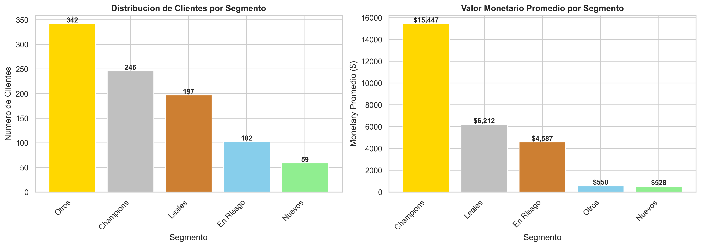
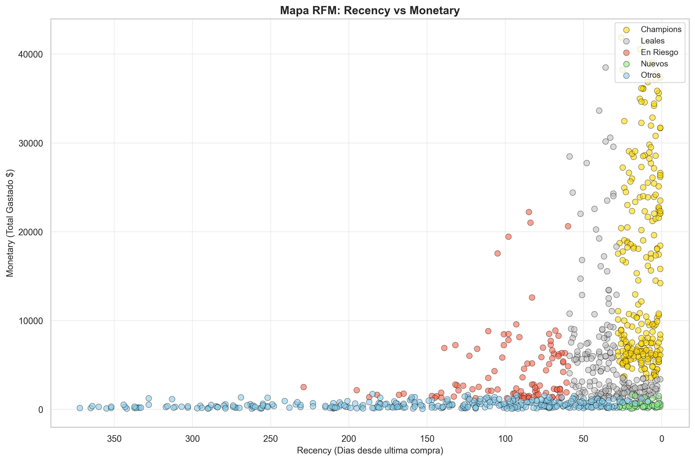
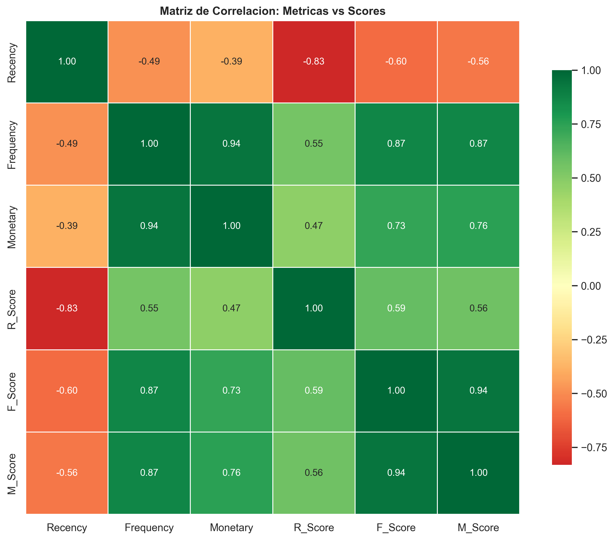

# Análisis RFM de clientes · comercio electrónico

**Juan Luis León Rodríguez · Proyecto TechAcces · datos sintéticos**

[Español](#español) · [English](#english)

## Español

> Los datos son **sintéticos** y los genera el propio repositorio (`Script_Datos_Sinteticos.ipynb`).
> Las cifras de retorno de la última tabla ilustran cómo se presenta un caso de negocio y no son
> resultados de ninguna empresa.

### El problema

Tienes 946 clientes y 7.741 pedidos del último año, y el lunes por la mañana hay que decidir a quién
llama el equipo comercial, porque llamar a todos no cabe en la semana. ¿Por dónde empiezas? Casi
todo el mundo ordena por facturación y baja por la lista, que es el orden que esconde justo lo que
más caro sale.

En estos datos vive el cliente 1029, que compró veintidós veces y dejó 20.637 dólares, así que
aparece arriba en cualquier informe anual de ventas. Lleva dos meses sin volver, cosa que el
acumulado de doce meses no dice en ninguna parte. Ese acumulado mete en un solo número lo que pasó
en junio y lo que pasó la semana pasada; una vez sumado, las dos cosas ya no se distinguen. Cuando
alguien se da cuenta, ese cliente ya compra en otro sitio, y el aviso llevaba meses escrito en las
fechas de sus pedidos. Nadie las lee porque recorrerlas una a una para 946 clientes no es trabajo de
una persona.

Este repositorio toma esa lista de pedidos, la resume en tres números por cliente, reparte la
cartera en cinco grupos y propone una acción comercial para cada uno. El método se llama RFM y lo
usa cualquier equipo de marketing con una base de clientes delante.

### Las tres letras

**RFM** son las iniciales inglesas de *recency*, *frequency* y *monetary*, o sea recencia,
frecuencia e importe. Son tres preguntas sobre cada cliente, y las tres se contestan con la lista de
pedidos que ya tienes.

| Número | La pregunta que contesta | Lo que sale en estos datos |
|---|---|---|
| **Recencia** | ¿Cuántos días hace que compró por última vez? | De 1 a 372 días, y menos días es mejor |
| **Frecuencia** | ¿Cuántas veces ha comprado? | Entre 1 y 30 pedidos, con una media de 8,2 |
| **Importe** | ¿Cuánto ha dejado en total? | Desde 77 hasta 41.889 dólares, con la mitad de la cartera por debajo de 1.870 |

Ninguna de las tres vale por su cuenta. Mirando la frecuencia sin la recencia sale un cliente fiel
que ya se fue, y mirando el importe sin las otras dos sale el que hizo una compra grande y nunca
volvió. Juntas cuentan la historia entera, o sea cuánto vale cada cliente, cada cuánto viene y si
sigue viniendo.

### Por qué el corte lo pone la cartera

**Segmentar** es partir la cartera en unos pocos grupos donde los clientes de dentro se parecen
entre sí y a los de fuera no, para poder tratar a cada grupo de una manera. Nadie diseña una campaña
para 946 personas distintas, sino que diseña cuatro o cinco, y entonces toda la pregunta pasa a ser
en qué saco cae cada cliente.

¿Merece la pena partirla? En estos datos los 246 Champions son el 26 % de la cartera y el 66,5 % de
las ventas, mientras que los 401 clientes de Nuevos y Otros juntos se quedan en el 42,4 % de la
cartera y el 3,8 % de las ventas. Repartir el mismo esfuerzo comercial por igual entre esos dos
bloques rinde de forma muy distinta.

Falta decidir dónde va la raya de cada grupo, y ahí se usan quintiles. **Quintil** se llama a cada
una de las cinco partes iguales en que se corta una lista ordenada, de forma que el quinto de
clientes que más gasta recibe un 5, el siguiente un 4, y así hasta el 1. Casi todo el mundo lo haría
a ojo: cliente bueno el que pasa de 5.000 dólares, cliente dormido el que lleva más de tres meses
sin comprar. El problema de esos números está en su origen, porque los pone alguien de memoria,
valen para un sector y no para otro, y envejecen solos en cuanto suben los precios o cambia la
estación.

Con quintiles el corte no se inventa, se lee de tu propia cartera. Los que salen en estos datos son
los siguientes:

| Corte | Recencia | Frecuencia | Importe |
|---|---|---|---|
| p20 | 13 días | 2 compras | 405 $ |
| p40 | 28 días | 4 compras | 1.246 $ |
| p60 | 59 días | 7 compras | 3.537 $ |
| p80 | 121 días | 13 compras | 8.489 $ |

Fíjate en la columna del importe. Esos 5.000 dólares que parecían el listón del buen cliente caen
entre 3.537 y 8.489, o sea en mitad del cuarto grupo de cinco, ni el mejor ni la media. Puesto a
mano, ese umbral habría llamado excelente a un cliente del montón.

### El código de tres cifras

Al pegar las tres puntuaciones sale un **código RFM**, y el cliente 1108 tiene un `455`: compró hace
veintiséis días, veintinueve veces, y lleva gastados 41.889 dólares, que es el máximo de toda la
cartera. Ese código se lee de un vistazo. Un `511` es alguien que acaba de estrenarse, un `155` es
un cliente valioso que se está enfriando, y un `111` es alguien que se fue hace mucho y nunca compró
gran cosa.

El código decide el grupo con estas reglas, escritas en el propio cuaderno:

```
Champions → R>=4, F>=4, M>=4
Leales    → R>=3, F>=3, M>=3
Nuevos    → R>=4, F<=2
En riesgo → R<=2, F>=3, M>=3
Otros     → el resto
```

Ese orden importa, porque cada cliente se queda en la primera regla que cumple.

### Los cinco grupos

| Segmento | Clientes | % | Valor promedio | Recencia | Frecuencia |
|----------|----------|---|----------------|---------|-----------|
| Champions | 246 | 26% | $15.447 | 12 días | 16,8 |
| Leales | 197 | 21% | $6.212 | 33 días | 9,3 |
| En riesgo | 102 | 11% | $4.587 | 96 días | 8,1 |
| Nuevos | 59 | 6% | $528 | 13 días | 2,5 |
| Otros | 342 | 36% | $550 | 144 días | 2,3 |



El grupo más numeroso es Otros, con 342 clientes, y el que sostiene el negocio es Champions. La
diferencia de valor entre los dos, medida sobre estos datos, es de 29,28 veces.



El mapa coloca a cada cliente según los días que lleva sin comprar y el dinero que ha dejado.
Arriba a la derecha, en amarillo, están los Champions, recientes y de alto gasto; en el centro, en
gris, los Leales; a la izquierda, en rojo, los que llevan meses callados, y abajo, en verde y azul,
quedan Nuevos y Otros.

### El cuaderno se comprueba a sí mismo



Antes de dibujar nada, el cuaderno pasa nueve verificaciones sobre su propio trabajo. Que los
Champions tengan de media menos de treinta días sin comprar, que los Nuevos compren poco, que la
puntuación de recencia baje cuando los días suben. Las nueve salen en verde con los datos de hoy.

Tres de esas comprobaciones son correlaciones entre cada puntuación y el número del que sale. Una
**correlación** mide si dos cantidades se mueven a la vez, con un valor entre −1 y 1, donde el signo
dice en qué dirección y el tamaño dice cuánto:

- R_Score frente a recencia: −0,83, negativa porque a más días sin comprar, menor puntuación.
- F_Score frente a frecuencia: 0,87.
- M_Score frente a importe: 0,76.

### Qué está medido

Comprobado ejecutando el repositorio el 22 de julio de 2026, con Python 3.14.6 y pandas 3.0.3, o sea
versiones bastante más nuevas que las de su publicación:

| Comprobación | Resultado |
|---|---|
| El cuaderno de análisis se ejecuta entero | sí, 12,4 segundos, sin errores |
| Sus nueve verificaciones internas | las nueve en verde |
| Los tres gráficos regenerados | idénticos byte a byte a los publicados |
| El generador reproduce el fichero de datos | idéntico byte a byte |

Todas las cifras de esta portada se recalcularon además por una vía distinta, con un programa propio
que lee el fichero de pedidos sin usar pandas. Los 946 clientes, los 7.741 pedidos, los cinco
grupos, sus medias y las tres correlaciones dan lo mismo hasta el último decimal.

### Lo que falla

**El generador de datos no arranca al clonarlo.** Pide un entorno de Python privado del ordenador de
su autor, llamado `conda-env-accident_agent-py`, que encima es el de otro proyecto distinto. Un
cambio de julio arregló ese mismo defecto en el cuaderno de análisis y dejó el generador como
estaba. Forzándole el intérprete a mano funciona y reproduce el fichero exacto, así que el fallo
está en la etiqueta y no en el programa.

**Una cuenta mal copiada dentro del cuaderno.** Su resumen afirma que los Champions gastan «3x más
que Leales, 28x más que Nuevos», y lo medido da 2,49 y 29,28. Ese 28 existe, pero contra el grupo
Otros; se coló al pasarlo de un sitio a otro.

**La frontera del quintil es frágil por construcción.** Como el quintil compara a cada cliente
contra los demás, el corte se mueve cuando cambia la cartera, y dos clientes casi idénticos pueden
caer a lados distintos de la raya. Con sesenta días sin comprar, el cliente 1029 sale En riesgo; el
1120, con cincuenta y nueve días y las mismas veintidós compras, sale Leal. Por un día de diferencia
uno recibe campaña de recuperación y el otro no.

**El cuaderno recalcula los cortes de quintil una vez por cada cliente** en lugar de una vez para
todos. Ese derroche se paga en cuanto la cartera crece:

| Clientes | Tiempo de puntuar cada columna |
|---|---|
| 946 | 0,7 segundos |
| 12.217 | 20 segundos |
| 64.000 | 232 segundos |

Esta portada prometía que el método aguanta más de 100.000 transacciones, y a esa escala la promesa
se cumple, porque sale en poco más de un minuto. Donde falla es en una cartera de cientos de miles
de clientes, porque cada vez que se dobla el número de clientes el tiempo se multiplica por tres.
Pandas trae una función que hace ese mismo reparto en dos milésimas de segundo a cualquier tamaño,
aunque el cuaderno la ignora.

### Las acciones propuestas

Las tres acciones de abajo son un ejercicio de cómo se presenta un caso de negocio a partir de la
segmentación. Antes de leerlas, conviene mirar su tamaño. Las ventas de los doce meses suman 5,71
millones de dólares y el impacto que se propone son 2,3 millones, o sea el 40 % de toda la
facturación. Solo el programa VIP promete subir un 55 % lo que gastan unos clientes que ya son los
que más gastan. Leerlas como una previsión de lo que va a pasar sería un error.

**Programa VIP para los 246 Champions.** Acceso anticipado de 48 horas, gestor de cuenta dedicado,
5 % de devolución por encima de 5.000 dólares y eventos por invitación.

**Campaña de recuperación para los 102 clientes en riesgo.** Secuencia de correos de 30 días,
descuento del 25 % y retargeting, que es volver a mostrarle anuncios a quien ya visitó la tienda.

**Primeros 90 días para los 59 clientes nuevos.** Correos automáticos, descuento creciente y
gamificación, o sea añadir mecánicas de juego a la relación con la marca.

| Acción | Inversión | Retorno | ROI |
|--------|-----------|---------|-----|
| VIP Champions | $50K | $2,1M | 42:1 |
| Reactivación | $5K | $160K | 32:1 |
| Onboarding | $10K | $42,5K | 4:1 |
| **TOTAL** | **$65K** | **$2,3M** | **35:1** |

### Cuándo no sirve

Aquí el dinero no es dinero. Los datos están inventados y los genera el propio repositorio para
enseñar el método sin publicar clientes reales, de manera que las cifras de retorno de la tabla
anterior ilustran una forma de presentar en vez de un resultado.

Tampoco el método lo explica todo, porque RFM mira ventas y nada más. Del margen de cada producto y
del coste de servir a cada cliente no sabe nada, así que el que más factura puede no ser el que más
deja. Tampoco dice por qué alguien se fue, ya que de las incidencias, del trato recibido o de lo que
ofrece la competencia no queda ni rastro en una lista de pedidos.

### Estructura del proyecto

```
RFM-Customer-Analytics/
├── 01_Analisis_RFM_Completo.ipynb   # El análisis entero: RFM, segmentación y gráficos
├── Script_Datos_Sinteticos.ipynb    # El generador del dataset sintético
├── raw_data_12meses.csv             # Los 7.741 pedidos de 12 meses
├── raw_data.csv                     # Dataset auxiliar
├── 01_segmentacion_barras.png
├── 02_rfm_scatter.png
└── 03_correlacion_heatmap.png
```

Con abrir el cuaderno de análisis basta para entenderlo todo, y tarda doce segundos en ejecutarse.

### Cómo reproducirlo

Hacen falta Python 3.9 o superior y Jupyter para abrir el cuaderno con estas dos órdenes:

```bash
pip install pandas matplotlib seaborn
jupyter notebook 01_Analisis_RFM_Completo.ipynb
```

El cuaderno se ejecuta de arriba abajo. La primera celda carga los datos, las siguientes calculan
los tres números y las puntuaciones, después vienen las nueve verificaciones y al final los tres
gráficos.

### Repos relacionados

Este análisis es una pieza de un portfolio de casos de analítica, junto a las piezas hermanas que
siguen:

- [lead-scoring-ml](https://github.com/jleonceo/lead-scoring-ml): predecir qué lead acaba comprando, con modelos de clasificación.
- [accident-intelligent-agent](https://github.com/jleonceo/accident-intelligent-agent): ETL, exploración y modelo para predecir la gravedad de un accidente de tráfico.
- [analisis-contable](https://github.com/jleonceo/analisis-contable): análisis financiero de una empresa con Python, del libro diario a las conclusiones.

*Parte del portfolio de [Juan Luis León](https://github.com/jleonceo) · [juanluisleon.vercel.app](https://juanluisleon.vercel.app) · Licencia [MIT](LICENSE)*

## English

> The data is **synthetic** and generated by the repository itself (`Script_Datos_Sinteticos.ipynb`).
> The return figures in the last table illustrate how a business case is presented and are not the
> results of any company.

### The problem

You have 946 customers and 7,741 orders from the last twelve months, and on Monday morning someone
has to decide who the sales team calls, because calling everyone does not fit in the week. Where do
you start? Most people sort by revenue and work down the list, which is the order that hides exactly
what costs the most.

Customer 1029 lives in this data, having bought twenty-two times and left 20,637 dollars, so they
show up near the top of any annual sales report. They have not been back for two months, which the
twelve-month total says nowhere. That total puts what happened in June and what happened last week
into one number; once added up, the two are no longer distinguishable. By the time anyone notices,
that customer is buying elsewhere, and the warning had been written in the dates of their orders for
months. Nobody reads those dates, because going through them one by one for 946 customers is not a
job for a person.

This repository takes that order list, boils each customer down to three numbers, splits the base
into five groups and proposes a commercial action for each one. The method is called RFM and any
marketing team with a customer base can use it.

### The three letters

**RFM** stands for recency, frequency and monetary value. They are three questions about each
customer, and all three are answered with the order list you already have.

| Number | The question it answers | What comes out in this data |
|---|---|---|
| **Recency** | How many days since the last purchase? | From 1 to 372 days, and fewer is better |
| **Frequency** | How many times have they bought? | Between 1 and 30 orders, averaging 8.2 |
| **Monetary** | How much have they spent in total? | From 77 to 41,889 dollars, with half the base below 1,870 |

None of the three is worth much on its own. Frequency without recency gives you a loyal customer who
already left, and monetary value without the other two gives you the one who made a big purchase and
never came back. Together they tell the whole story: how much a customer is worth, how often they
come and whether they still come.

### Why the cut-off comes from the data

**Segmenting** means splitting the customer base into a few groups whose members resemble each other
and differ from those outside, so each group can be handled its own way. Nobody designs a campaign
for 946 different people, they design four or five, and the whole question becomes which bucket each
customer falls into.

Is splitting worth it? In this data the 246 Champions are 26% of the base and 66.5% of sales, while
the 401 customers in New and Others together account for 42.4% of the base and 3.8% of sales.
Spreading the same commercial effort evenly across those two blocks pays off very differently.

What remains is deciding where each group's line goes, which is the job of quintiles. A
**quintile** is each of the five equal parts an ordered list is cut into, so the fifth of customers
who spend most get a 5, the next one a 4, and so on down to 1. Most people would do it by eye: a
good customer spends over 5,000 dollars, a dormant one has been quiet for more than three months.
The trouble with those numbers is where they come from, because somebody sets them from memory, they
suit one sector and not another, and they age on their own as soon as prices rise or the season
turns.

With quintiles the cut-off is not invented, it is read off your own customer base. The ones that
come out in this data are the following:

| Cut-off | Recency | Frequency | Monetary |
|---|---|---|---|
| p20 | 13 days | 2 purchases | $405 |
| p40 | 28 days | 4 purchases | $1,246 |
| p60 | 59 days | 7 purchases | $3,537 |
| p80 | 121 days | 13 purchases | $8,489 |

Look at the monetary column. Those 5,000 dollars that looked like the bar for a good customer fall
between 3,537 and 8,489, that is, in the middle of the fourth group out of five, neither the best
nor the average. Set by hand, that threshold would have called an ordinary customer excellent.

### The three-digit code

Joining the three scores gives an **RFM code**, and customer 1108 has a `455`: they bought
twenty-six days ago, twenty-nine times, and have spent 41,889 dollars, the highest in the whole
base. The code reads at a glance. A `511` is somebody who has just started, a `155` is a valuable
customer going cold, and a `111` is somebody who left long ago and never bought much.

The code decides the group with these rules, written in the notebook itself:

```
Champions → R>=4, F>=4, M>=4
Loyal     → R>=3, F>=3, M>=3
New       → R>=4, F<=2
At Risk   → R<=2, F>=3, M>=3
Others    → everything else
```

The order matters, because each customer stays in the first rule they satisfy.

### The five groups

| Segment | Customers | % | Average value | Recency | Frequency |
|---------|-----------|---|---------------|---------|-----------|
| Champions | 246 | 26% | $15,447 | 12 days | 16.8 |
| Loyal | 197 | 21% | $6,212 | 33 days | 9.3 |
| At Risk | 102 | 11% | $4,587 | 96 days | 8.1 |
| New | 59 | 6% | $528 | 13 days | 2.5 |
| Others | 342 | 36% | $550 | 144 days | 2.3 |


The largest group is Others, with 342 customers, and the one holding up the business is Champions.
The gap in value between the two, measured on this data, is 29.28 times.


The map places each customer by days since the last purchase against money spent. Top right, in
yellow, sit the Champions, recent and high-spending; in the middle, in grey, the Loyal ones; on the
left, in red, those who have been quiet for months, and at the bottom, in green and blue, New and
Others.

### The notebook checks its own work


Before drawing anything, the notebook runs nine checks over its own output. That Champions average
fewer than thirty days since their last purchase, that New customers buy little, that the recency
score falls as the days rise. All nine of them come out green on today's data.

Three of those checks are correlations between each score and the number it derives from. A
**correlation** measures whether two quantities move together, with a value between −1 and 1, where
the sign says in which direction and the size says how strongly:

- R_Score against recency: −0.83, negative because more days without buying means a lower score.
- F_Score against frequency: 0.87.
- M_Score against monetary value: 0.76.

### What has been measured

Checked by running the repository on 22 July 2026, with Python 3.14.6 and pandas 3.0.3, versions
considerably newer than the ones it was published with:

| Check | Result |
|---|---|
| The analysis notebook runs end to end | yes, 12.4 seconds, no errors |
| Its nine internal checks | all nine green |
| The three charts, regenerated | byte for byte identical to the published ones |
| The generator reproduces the data file | byte for byte identical |

Every figure on this page was also recomputed by a different route, with a purpose-built program
that reads the order file without using pandas. The 946 customers, the 7,741 orders, the five
groups, their averages and the three correlations all come out the same to the last decimal.

### What is broken

**The data generator does not start on a fresh clone.** It asks for a private Python environment
from its author's machine, named `conda-env-accident_agent-py`, which belongs to a different project
on top of that. A July commit fixed the same defect in the analysis notebook and left the generator
as it was. Forcing the interpreter by hand it works and reproduces the exact file, so the fault is
in the label rather than in the program.

**A ratio copied wrong inside the notebook.** Its summary claims Champions spend "3x more than
Loyal, 28x more than New", and the measurement gives 2.49 and 29.28. That 28 does exist, but against
the Others group; it slipped while being moved from one place to another.

**The quintile boundary is fragile by construction.** Since a quintile compares each customer
against the rest, the cut-off moves when the base changes, and two nearly identical customers can
land on opposite sides of the line. At sixty days without buying, customer 1029 comes out At Risk;
customer 1120, at fifty-nine days and with the same twenty-two purchases, comes out Loyal. One day
apart, one gets a win-back campaign and the other does not.

**The notebook recomputes the quintile cut-offs once per customer** instead of once for everyone.
That waste is paid for as soon as the base grows:

| Customers | Time to score each column |
|---|---|
| 946 | 0.7 seconds |
| 12,217 | 20 seconds |
| 64,000 | 232 seconds |

This page used to promise that the method holds up beyond 100,000 transactions, and at that scale
the promise holds, because it finishes in a little over a minute. Where it fails is on a base of
hundreds of thousands of customers, because every doubling of the customer count multiplies the time
by three. Pandas ships a function that does the same split in two thousandths of a second at any
size, which the notebook ignores.

### The proposed actions

The three actions below are an exercise in how a business case is presented on top of the
segmentation. Before reading them, it is worth looking at their size. Sales over the twelve months
add up to 5.71 million dollars and the impact proposed here is 2.3 million, that is, 40% of the
entire turnover. The VIP programme alone promises to raise spending by 55% among customers who
already spend the most. Reading these as a forecast of what will happen would be a mistake.

**A VIP programme for the 246 Champions.** Forty-eight hour early access, a dedicated account
manager, 5% cashback above 5,000 dollars and invitation-only events.

**A win-back campaign for the 102 at-risk customers.** A 30-day email sequence, a 25% discount and
retargeting, which means showing ads again to someone who already visited the shop.

**First 90 days for the 59 new customers.** Automated emails, an escalating discount and
gamification, that is, adding game mechanics to the relationship with the brand.

| Action | Spend | Return | ROI |
|--------|-------|--------|-----|
| VIP Champions | $50K | $2.1M | 42:1 |
| Win-back | $5K | $160K | 32:1 |
| Onboarding | $10K | $42.5K | 4:1 |
| **TOTAL** | **$65K** | **$2.3M** | **35:1** |

### When it does not apply

Here the money is not money. The data is invented and generated by the repository itself, so the
method can be taught without publishing real customers, which makes the return figures in the table
above an illustration of a format rather than a result.

The method does not explain everything either, because RFM looks at sales and nothing else. It knows
nothing about the margin on each product or the cost of serving each customer, so the one who bills
most may not be the one who leaves most behind. It does not say why somebody left either, since
support incidents, the treatment they got and what the competition offers leave no trace whatsoever
in an order list.

### Project layout

```
RFM-Customer-Analytics/
├── 01_Analisis_RFM_Completo.ipynb   # The whole analysis: RFM, segmentation and charts
├── Script_Datos_Sinteticos.ipynb    # The generator for the synthetic dataset
├── raw_data_12meses.csv             # The 7,741 orders across 12 months
├── raw_data.csv                     # Secondary dataset
├── 01_segmentacion_barras.png
├── 02_rfm_scatter.png
└── 03_correlacion_heatmap.png
```

Opening the analysis notebook is enough to understand the whole thing, and running it takes twelve
seconds.

### Reproducing it

You need Python 3.9 or later and Jupyter to open the notebook with these two commands:

```bash
pip install pandas matplotlib seaborn
jupyter notebook 01_Analisis_RFM_Completo.ipynb
```

The notebook runs from top to bottom. The first cell loads the data, the next ones compute the three
numbers and the scores, then come the nine checks, and the three charts close it.

### Related repositories

This analysis is one piece of an analytics portfolio, alongside the sibling projects that follow:

- [lead-scoring-ml](https://github.com/jleonceo/lead-scoring-ml): predicting which lead ends up buying, with classification models.
- [accident-intelligent-agent](https://github.com/jleonceo/accident-intelligent-agent): ETL, exploration and a model to predict how severe a road accident is.
- [analisis-contable](https://github.com/jleonceo/analisis-contable): financial analysis of a company with Python, from the ledger to the conclusions.

*Part of [Juan Luis León](https://github.com/jleonceo)'s portfolio · [juanluisleon.vercel.app](https://juanluisleon.vercel.app) · [MIT](LICENSE) licence*
